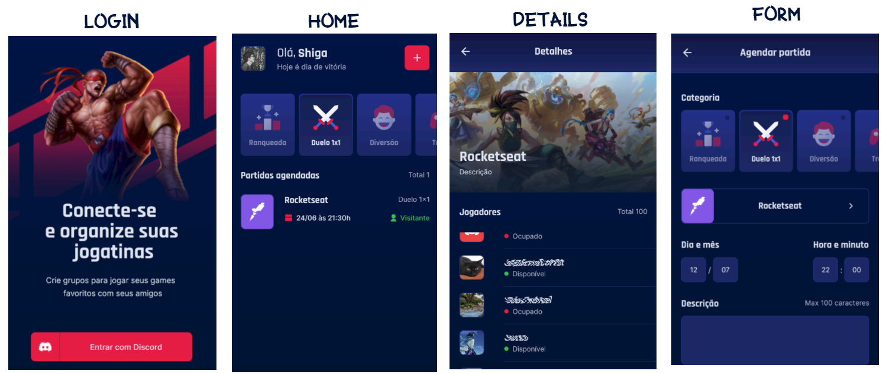

  

<h3 align="center">
<strong>Project based on Next Level Week Together</strong>
</h3>

  
  
  
  
   
   
  <a href="#space_invader-technologies">Technologies</a>
   
   
  
   
   

## :space_invader: Technologies

- [React Native](https://reactnative.dev/)
- [Expo](https://expo.io/)
- Typescript
